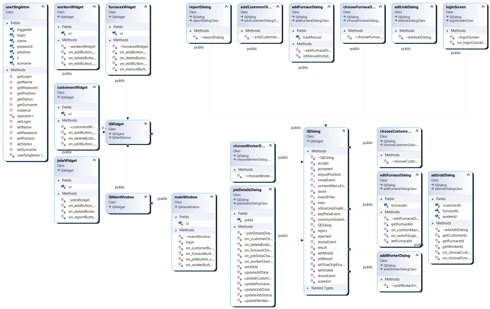
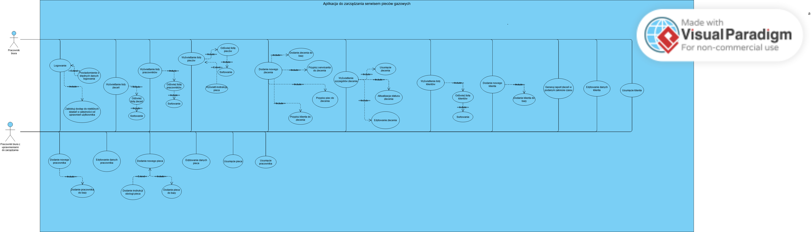
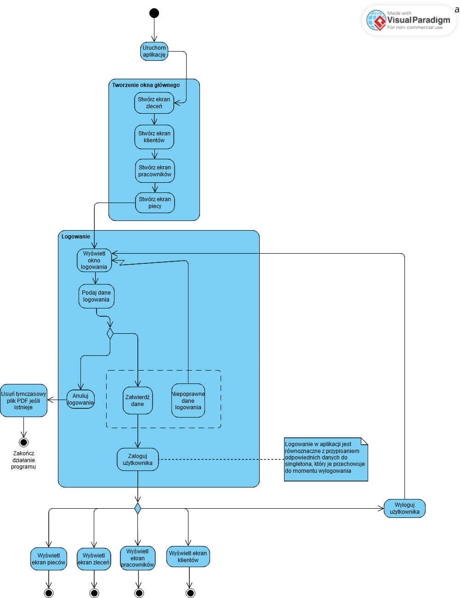
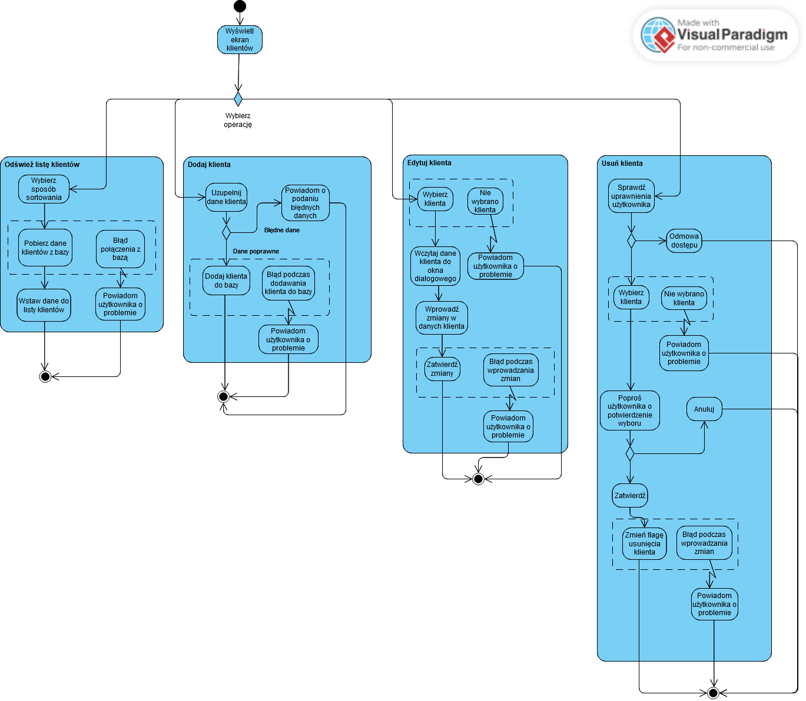
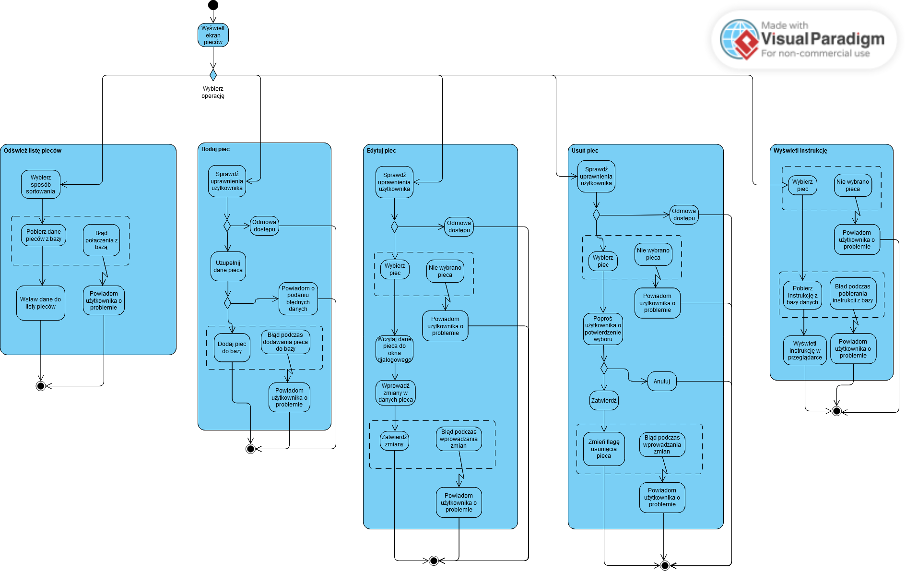
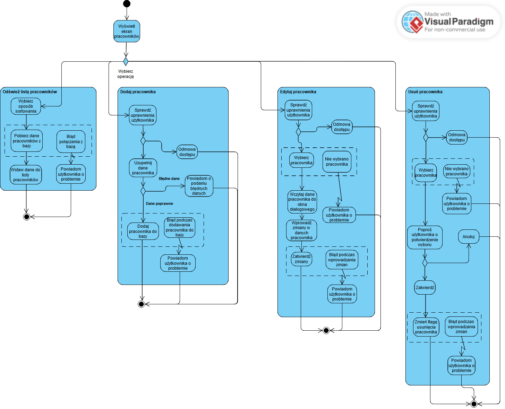
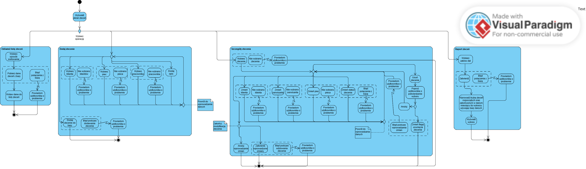

Projekt na studia - aplikacja biurowa firmy (serwisu pieców gazowych). Zrobiona w C++, używa MySql C++ Connector do łączenia z bazą danych oraz QT6 do stworzenia interfejsu użytkownika.

Aby aplikacja działała poprawnie należy zmienić konfigurację w plikach:

  mysql\bin\my.ini:
  
    max_allowed_packet=512M
    
  xampp\php\php.ini:
  
    max_execution_time = 259200
    
    max_input_time = 259200
    
    memory_limit = 1000M
    
    upload_max_filesize = 750M
      
    post_max_size = 750M
    

Diagram przypadków klas do projektu:

Diagram przypadków użycia do projektu:

Diagramy aktywności do projektu:

- Tworzenie okna głównego i logowanie:

- Ekran zarządzania klientami:

- Ekran zarządzania piecami:

- Ekran zarządzania pracownikami:

- Ekran zarządzania zleceniami:

